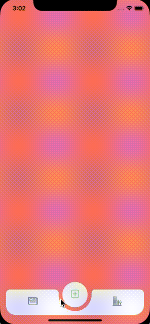

# React Native Tabbar Interaction

A tabbar component for React Native

## Installation
`npm i react-native-tab-bar-interaction`
Android: `react-native run-android`
iPhone: `react-native run-ios`

## Preview


## Description
Beautiful React native tabbar Interaction inspired by [this](https://dribbble.com/shots/4844696-Tab-bar-interaction-with-animated-icons) dribble from [Ketan Rajput](https://twitter.com/Ketan_MI)


# Usage

```js

import TabBar from "react-native-tab-bar-interaction";
...
  render() {
    return (<TabBar>
             <TabBar.Item
                 icon={require('./tab1.png')}
                 selectedIcon={require('./tab1_sel.png')}
                 title="Tab1"
                 screenBackgroundColor={{ backgroundColor: '#008080' }}
             >
               <View>
   
               </View>
             </TabBar.Item>
             <TabBar.Item
                 icon={require('./tab2.png')}
                 selectedIcon={require('./tab2_sel.png')}
                 title="Tab2"
                 screenBackgroundColor={{ backgroundColor: '#F08080' }}
             >
               <View>
   
               </View>
             </TabBar.Item>
             <TabBar.Item
                 icon={require('./tab3.png')}
                 selectedIcon={require('./tab3_sel.png')}
                 title="Tab3"
                 screenBackgroundColor={{ backgroundColor: '#485d72' }}
             >
               <View>
   
               </View>
             </TabBar.Item>
           </TabBar>);
  }
```

### Component props

| prop | value | required/optional | description |
| --- | --- | --- | --- |
| icon | image source | required | the icon when item is not focus |
| selectedIcon | image source | required | the icon when item is focus |
| title | string | required | title of item |
| screenBackgroundColor | string | required | background color of tab |

## Dependencies

* `react-native-svg`


# LICENSE!

React-native-tabbar-interaction is [MIT-licensed](https://github.com/Mindinventory/react-native-tabbar-interaction/blob/master/LICENSE).

# Let us know!
We’d be really happy if you send us links to your projects where you use our component. Just send an email to sales@mindinventory.com And do let us know if you have any questions or suggestion regarding our work.
